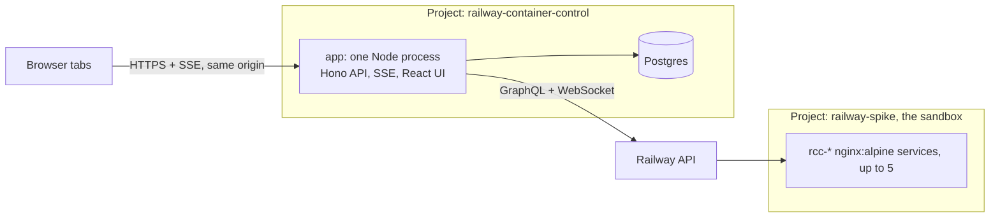

# Engineering Requirements Document: Railway container control

A web app, deployed on Railway, that creates, stops, starts and destroys `nginx:alpine`
containers through Railway's public GraphQL API and shows each one's state live.

- Spec: [issue #1](https://github.com/V473r10/railway-take-home/issues/1). Vocabulary:
  [CONTEXT.md](../CONTEXT.md). Decisions with lasting weight: [docs/adr](adr).
- Live at [app-production-c949.up.railway.app](https://app-production-c949.up.railway.app),
  behind a shared password.

## The problem

The naive version (a button that calls `serviceCreate`, a page that polls for status)
fails in the ways a deploy platform cares about:

- a double click creates two services;
- a dropped connection leaves you not knowing whether a service exists;
- one tab polling every 2 s (1800 requests/hour) exceeds the Hobby limit of 1000 on its own;
- an invalid token is not rejected but treated as anonymous, which can still create resources;
- a public URL with a Create button spends the owner's money for anyone who finds it.

Each section below is one decision, the alternative that was rejected, and why.

## Architecture

One process holds four background duties besides the HTTP API: the observer, the
reconciler (at boot), the lifetime sweep and the missing sweep (each at boot and every
minute).

### One service for API and UI, a managed Postgres beside it

Hono serves the API, the SSE feed and the built React files from one process, in one
Railway service; Postgres is a second service in the same project.

- **Rejected: the UI as a separate static service.** It would not make the UI more
  resilient: once loaded it runs in the browser, and without the API it shows nothing
  useful. It would cost a service slot, CORS, a cookie crossing origins and two deploys
  to keep in step.

### Containers live in a separate sandbox project ([ADR 0002](adr/0002-containers-live-in-a-separate-sandbox-project.md))

- **Rejected: containers in the app's own project.** A bug in `serviceDelete` could then
  target the app or its database, and containers would share the 5 service slots with
  them. The cost: Hobby allows 2 projects, so there is no room for a staging copy.

### One backend observer, fanned out over SSE ([ADR 0001](adr/0001-single-backend-observer-fanned-out-over-sse.md))

Per container, the observer subscribes to the current deployment, then reads it once by
query (subscriptions do not send the current state on connect) and keeps the newer of the
two. A dropped subscription becomes polling with backoff (2 s doubling to 60 s), not
silence. Each change is read from the database once and sent to every tab.

- **Rejected: browsers poll the backend, the backend polls Railway behind a cache.**
  Railway traffic would grow with activity instead of with the number of containers.
- **Rejected: browsers talk to Railway directly.** It exposes the token and puts the rate
  limit in every reviewer's hands.
- **Consequence:** one app instance. Scaling out needs a leader or shared pub/sub.

**Found by the real smoke test, not by the fake:** the subscription pushes only `status`
changes. A Stop leaves `SUCCESS` and flips only `deploymentStopped`, so the first real Stop
waited forever. The observer now confirms a Stop by reading with backoff, and the fake
pushes only status changes, like Railway.

## Operations

### Every click is an operation, separate from the container

Two tables: `containers` (what exists, and what Railway last reported) and `operations`
(what was asked for, with its own lifecycle). The state the user sees is derived from
both.

- **Rejected: one state column on the container** mixing "what you asked for" with "what
  Railway says". Intent and observation have to be separate for idempotency, retries and
  the reconciler to be expressible at all.

### Two layers of idempotency ([ADR 0004](adr/0004-two-layer-idempotency-because-servicecreate-takes-no-key.md))

`serviceCreate` takes no idempotency key, and Railway's docs say not to assume
exactly-once semantics.

1. **Our API:** every click carries an `Idempotency-Key` with a unique constraint. A
   repeated key returns the same operation (200), and the operation is recorded before
   Railway is called.
2. **Railway's API:** the service is named `rcc-<operation id>`. Before repeating any call
   that may have acted, the app looks at Railway first: Create searches by name, the
   domain is searched on the service, Stop checks whether the deployment is already
   stopped, Start checks for a newer deployment, Destroy checks whether the service still
   exists.

- **Rejected: only the database constraint.** It stops a double click, not a retry after
  Railway acted and the response was lost.
- **Rejected: only the lookup by name.** Two concurrent clicks would both look, both miss,
  both create.

### Retries: only when there was no answer

One rule for every call (`src/server/retry.ts`), at most 5 calls per step: a 429 waits
for `Retry-After`; no response waits 1, 2, 4, 8 s, after looking at Railway; a 200 with
`errors[]` is final, and the operation fails with the message and Railway's `traceId`.
If the lookup itself gets no answer, the call is not repeated.

- **Rejected: no automatic retries.** It hands the ambiguous outcome to the user, who
  cannot know whether the first click worked.

### One active operation per container; Destroy always allowed

A partial unique index allows one active non-Destroy operation per container, and a
second for Destroy. A request locks the container row first, so a concurrent click gets
a plain refusal ("Wait for Create to finish.") instead of a database error. The same rule
fills `actions.stop` / `actions.start` in every container, so the UI disables a button
for exactly the reason the API would give.

- **Rejected: queue the click.** It needs a definition of what a queue of intentions
  means (does Stop, Start, Stop collapse?).
- **Rejected: cancel the running operation with `deploymentCancel`.** Kept as a stretch.
- **Destroy is the exception** because it is the way out. It supersedes the running
  operation ("Superseded by Destroy."). During a Create it waits for `serviceCreate` to
  answer; otherwise the service Railway creates afterwards would be orphaned.

### A failed create stays visible

If the service was created but its deployment failed, the container stays `failed` with
Destroy available.

- **Rejected: destroy it automatically.** The reviewer would not see what went wrong; the
  lifetime cleans it up within 30 minutes anyway.

## Railway is the source of truth

### Observed state wins

If Railway and the database disagree, the database is corrected: a container that went
down after running shows `crashed` (Railway's fault, not the request's, which is
`failed`); a service deleted from the dashboard shows `missing`. Nothing is re-created.

- **Rejected: the database wins and the app repairs Railway.** That is an orchestrator,
  out of scope.

`missing` comes from a sweep that lists the sandbox's services in one call, at boot,
every minute and when the observer suspects a deletion. The observer alone cannot tell a
deletion from a Railway blip, so nothing is concluded without a successful list.

### The app owns only what it created

A sandbox service belongs to the app only if it has a row in `containers`. The `rcc-`
prefix is used for the name lookup and nothing else.

- **Rejected: ownership by prefix.** A hand-made `rcc-foo` would be destroyed when its
  "lifetime" ran out.

### The reconciler finishes what a dead process left

At boot, before accepting requests, every active operation is resumed: it asks Railway
what already happened and does only what is missing (adopt the service found by name,
or create it; adopt the newer deployment, or redeploy). Migration `005` stores which
deployment a Start replaces, without which a restarted app cannot tell old from new.

- **Rejected: mark every active operation failed at boot.** It leaves services created
  but unrecorded, and turns every redeploy into user-visible failures.

The tests kill the backend at each Railway call, before and after Railway acts, and
start a second instance on the same database and fake: every case ends with exactly one
service.

## Cost guards

The whole app runs on a Hobby plan with USD 5 of credit, behind a public URL.

### Container limit: 5, stopped ones count

The count and the insert run in one transaction under an advisory lock, so two
concurrent creates cannot both take the fifth slot.

- **Rejected: count only running containers.** A stopped container still holds one of
  Railway's 5 service slots, so the sixth create would fail inside Railway with a worse
  error.

### Lifetime: 30 minutes from creation, whatever the state

A sweep at boot and every minute requests Destroy through the same path as a click, so
two sweeps, or a sweep and a click, cannot destroy twice. The UI shows a countdown.

- **Rejected: separate running and stopped timers.** "No container lives more than 30
  minutes" fits in one sentence, and frees the slots for the next reviewer.
- **Rejected: a separate Railway cron service.** While the app is down nobody can create
  containers, so cost is bounded by the ones that exist; the boot sweep catches up on
  return. A second service is not justified.

### The password is a cost barrier, not authentication

One shared password, a Railway variable, gates the whole app (reads included) with an
HMAC-signed, `HttpOnly`, `SameSite=Lax` cookie valid 7 days, compared in constant time.
Only `/api/health` (Railway's health check cannot send a cookie), the login route and
the static UI are open. Its purpose is that a stranger who finds the URL cannot spend the
owner's credit or see container URLs. It is not a user system: there are no users, no
login rate limit, no logout, and anyone with the password has full control.

- **Rejected: gate only the writes.** It exposes service ids and public URLs, and "no
  password, nothing" is one rule.

## Startup and identity

### Verify the token at boot; read-only if it fails ([ADR 0003](adr/0003-verify-token-identity-at-startup-read-only-on-failure.md))

Railway treats an invalid token as anonymous, and anonymous callers can still create
resources. At boot the app asks `me`; if that does not confirm an identity, it serves in
read-only mode: a red banner, every write refused with 503, the list still working. It
does not resume operations in that mode, because resuming writes to Railway.

- **Rejected: refuse to start.** Railway restarts crashed services, so a bad token
  becomes a silent crash loop.
- **Rejected: trust the first mutation to fail.** It does not fail.

This requires an account token: a workspace token cannot answer `me`.

**A deliberate inconsistency:** a missing `APP_PASSWORD` or `SESSION_SECRET` does stop
the app. That is a configuration error with a log line naming the variable, not a
runtime condition the reviewer could be looking at; serving without the gate would
defeat the cost barrier.

## Testing

All tests enter through the backend's HTTP API and assert what a user or Railway would
see: responses, SSE events and the calls the fake recorded.

- **Railway** is an in-memory fake behind the adapter interface. It injects what cannot
  be provoked on demand against real Railway: no response after acting, 429 with
  `Retry-After`, `errors[]`, a failed or crashed deployment, a service deleted from
  outside.
- **The clock** is injected, so the lifetime, the sweeps and the backoff are tested
  without waiting.
- **Postgres is real.** The unique constraints, the row lock and the limit transaction
  are what is under test; a fake database would hide exactly those bugs.
- **Rejected: tests only against real Railway.** The failures that matter cannot be
  triggered at will, and every run spends the rate limit and the credit.
- **Rejected: UI tests.** The UI renders what SSE delivers; the logic is in the backend.

126 tests, run five times in a row without flakes before each merge. Key tests were
checked by breaking the code on purpose (removing the name lookup, the advisory lock,
the reconciler, the boot sweep) and watching them fail. A manual smoke test against real
Railway (create, running, open the URL, stop, start, destroy) is recorded in the README;
its first run found the Stop bug above.

## Known limitations

- A Start whose redeploy acted but whose new deployment Railway does not list yet can be
  repeated: one extra deployment, never an extra service.
- Deleting a service from Railway's dashboard (`missing`) is covered by tests against the
  fake but has not been observed against real Railway.
- One instance only (ADR 0001).
- The app is deployed with `railway up`; Railway's GitHub app has no access to the
  repository, so a merge does not redeploy.
- `railway.json` is deprecated by Railway in favour of a newer config format, supported
  until 2026-12-01.

## Out of scope, and the obvious extensions

- **Real authentication**: multiple users, "Login with Railway" OAuth, per-user
  containers. The natural next step after the cost barrier.
- **A project-scoped token**: today an account token is needed for the `me` check; a
  token limited to the sandbox project would be least privilege.
- **Per-deployment step timeline** (`DeploymentEventStep`) and build-log streaming: with
  `nginx:alpine` a deploy takes seconds, so the timeline would barely show.
- **Cancelling an in-progress deployment** with `deploymentCancel`.
- **Queuing clicks** behind an active operation.
- **Making Railway match the database** (re-creating what Railway lost).
- Deploys from GitHub, user-chosen images, volumes, multiple environments, runtime logs,
  metrics.
- A separate cron service for lifetime enforcement.
